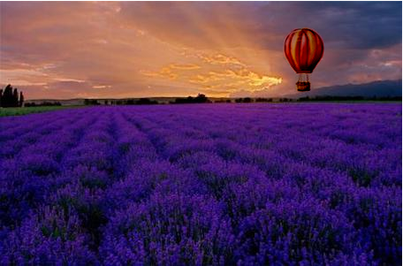
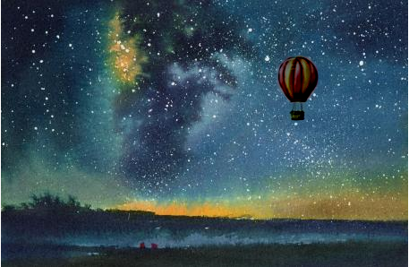

# Gradient blending

实现Gradient Blending

（1）用genmask去从源图像中选择一个区域；

（2）用拉普拉斯算子计算源图像的拉普拉斯图像；

（3）利用ginput在目标图像中点击一个点，将源图像中的区域的中心点对齐到这个点；

（4） 在目标图像中标记需要进行计算的像素点，并且对这些像素点进行重新的标号；

（5）构建线性方程组的矩阵A和b

（6）求解方程，得到像素的像素值，将像素值返回到目标图像的相应像素得到融合后的结果

### 结果

原图像：

背景图：

融合后的结果：

